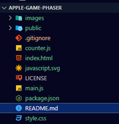
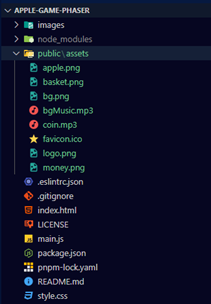
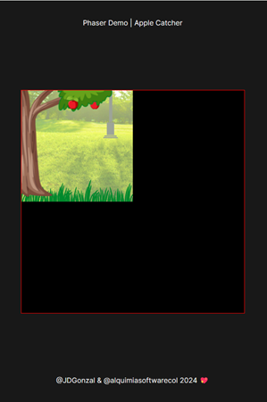

# APPLE-GAME-PHASER
Basado en este video:  
[](https://www.youtube.com/watch?v=0qtg-9M3peI)
>[!IMPORTANT] 
> * El código original está en este repositorio: 
>[Phaser-Apple-Catcher-Starter
](https://github.com/digitaldeja0/Phaser-Apple-Catcher-Starter)  
>del usuario [digitaldeja0](https://github.com/digitaldeja0) 
>desde Agosto 11 de 2023.
> * La librería base esta en este sitio: 
>[PHASER](https://phaser.io/).
> * Esta es una guía para empezar:
[Cómo crear tu primer juego con Phaser](https://phaser.io/tutorials/making-your-first-phaser-3-game-spanish#:~:text=Para%20iniciar%20un%20juego%20en,menudo%20desde%20una%20variable%20global.).

## 00 Precondiciones
1. Tener el Editor [Visual Studio Code](https://code.visualstudio.com/insiders/).
2. Extensiones insaladas dentro de 
`Visual Studio Code`:  
  * [Better Comments](https://marketplace.visualstudio.com/items?itemName=aaron-bond.better-comments) 
de [Aaron Bond](https://aaronbond.co.uk/).
  * [Error Lens](https://marketplace.visualstudio.com/items?itemName=usernamehw.errorlens) 
de [Alexander](https://marketplace.visualstudio.com/publishers/usernamehw).
  * [Javascript-Essentials](https://marketplace.visualstudio.com/items?itemName=Gydunhn.javascript-essentials)
  de [Gydunhn](https://marketplace.visualstudio.com/publishers/Gydunhn),  
  Este instala un paquete con:
    * ESLint
    * npm Intellisense 
    * IntelliCode
    * JavaScript (ES6) code snippets
    * Debugger for Firefox
    * Path Intellisense
    * Formatting Toggle
  * [Live Server](https://marketplace.visualstudio.com/items?itemName=ritwickdey.LiveServer)
  de [Ritwick Dey](https://marketplace.visualstudio.com/publishers/ritwickdey).
  * [Image preview](https://marketplace.visualstudio.com/items?itemName=kisstkondoros.vscode-gutter-preview)
  de [Kiss Tamás](https://marketplace.visualstudio.com/publishers/kisstkondoros) 
3. Instalar `nvm` descargando el instalador desde este sitio:
[nvm-setup.exe](https://github.com/coreybutler/nvm-windows/releases/download/1.1.12/nvm-setup.exe).
4. Instalar el `node`, que a su vez
trae el `npm` basado en este sitio: 
[Instalar múltiples versiones de Node.js en Windows](https://rafaelneto.dev/blog/instalar-multiples-versiones-nodejs-windows/).  
Con el `nvm` permite múltiples versiones
del `node`.
5. El programa `pnpm` es similar al `npm`, siendo un mejor empaquetador.  
Este lo puede conseguir con las instrucciones de este sitio
[pnpm Installation](https://pnpm.io/installation). 

## 01. Local Setup
1. Abrir una nueva `TERMINAL` y ejecutar el comando:
```bash
pnpm create vite@latest
```
* Project name: applegame
* Vanilla
* JavaScript
2. Pasamos el contenido de la carpeta "applegame" a la raiz del proyecto y borramos la carpeta "applegame", este es el resultado
esperado:  

3. Ejecutamos el comando en la `TERMINAL`:
```bash
pnpm install
```
4. Ejecutamos el comando en la `TERMINAL`:
```bash
pnpm i phaser
```
5. Ejecutamos el proyecto en la `TERMINAL` con:
```bash
pnpm dev
```
* La probable ruta puede ser: `http://localhost:5173/``
6. Navegamos a la ruta sugerida con cualquier browser.

## 02. Clean up Vite files
1. Empezamos con el archivo **style.css**, borrar todo excepto lo
relacionado con el `:root`.
2. Del `:root`, solo dejamos la línea de `font-family:`.
3. del archivo **main.js**, borrar todo menos la primera línea de
`import './style.css'`.
4. Borro los archivos:
  * **javascript.svg**
  * **counter.js**
5. Del archivo **index.html**, borramos la línea de 
`<div id="app"></div>`

>[!TIP]  
>### ESLint mejorador de javascript
>1. Tener instalado de forma global el `eslint`, con el comando:
>```bash
>npm install -g eslint
>```
>* **Esto solo se hace una vez y toca con el comando `npm`.**
>2. Instalar para el proyecto el paquete `standard`:
>```bash
>pnpm install standard -D
>```
>3. Crear el archivo **.eslintrc.json**, con este contenido:
>```json
> {
>   "extends": ["standard"],
>   "rules": {
>     "semi" : [2, "always"],
>     "comma-dangle": [2, "always-multiline"] 
>   }
> }
>```
>4. Presiono en `Visual Studio Code` las teclas: 
> [`Ctrl`] + [`Shift`] + [`P`]  
> y selecciono o busco `Restart ESLint Server`

>[!TIP]  
>### Si por alguna razón aparece el archivo **package-lock.json**, por favor borrarlo.  
>### Pues se supone estamos trabajando con `pnpm`.

## 03. Github Assets
1. Bajar del repositorio los [assets](https://github.com/digitaldeja0/Phaser-Apple-Catcher-Starter/tree/main/public/assets)
y poner esa carpeta en la carpeta "public".
2. Aprovechamos para borra el archivo **vite.svg** de la 
carpeta "public".
3. Así debe lucir hasta el momento nuestro proyecto:  


## 04. HTML Setup
1. Este capítulo es solo en el archivo **index.html**:
2. Cambiamos en la opción `"icon"` el `"/vite.svg"`, por 
`"/assets/favicon.ico"`
3. El `<title>`, lo cambiamos a `Apple Catcher`.
4. Al `<body>`, le agregamos tres elementos: `<header>`, `<main>` y
`<footer>`, todos antes del `<script ...">`.
5. Dentro del `<header>` , ponemos un `<p>`, con esto:
```html
      <p>Phaser Demo | Apple Catcher</p>
```
6. Dentro del `<footer>`, ponemos un `<p>`, con esto:
```html
      <p>Practicado por @JDGonzal <br>
        Colaboración @alquimiasoftwarecol</p>
```
7. En el `<main>` agrego un `<canvas>`, con esto:
```html
      <canvas id="gameCanvas"></canvas>
```

## 05. CSS Setup
1. Este capítulo es solo en el archivo **style.css**:
2. Creamos tres variables dentro del `:root` :
```css
:root {
  font-family: Inter, system-ui, Avenir, Helvetica, Arial, sans-serif;
  --dkClr : #181818;    /*Dark Color */
  --liClr: whitesmoke;  /*Light Color */
  --accClr: #0D0D35;    /*Accent Color */
}
```
3. Debajo del `:root` , definimos esto para todo, con un 
asterisco:
```css
*{
  margin: 0;
  padding: 0;
  box-sizing: border-box;
}
```
4. Añadimos el porcentaje de altura para `html` y `body`:
```css
html, body {
  height: 100%;
}
```
5. Esto solo para el `body`:
```css
body {
  background-color: var(--dkClr);
  color: var(--liClr);
  display: flex;
  flex-direction: column;
  min-height: 100vh;
}
```
6. Definimos esto para `header` y `footer`:
```css
header, footer {
  display: flex;
  justify-content: center;
  align-items: center;
  padding: 40px 20px;
}
```
7. Para solo `main` esto:
```css
main{
  flex: 1;
  display: flex;
}
```
8. Para el id de `gameCanvas`, definimos esto:
```css
#gameCanvas {
  border: 1px solid red;
  position: absolute;
  top: 50%;
  left: 50%;
  transform: translate(-50%, -50%);
  display: flex;
  z-index: 1;
}
```

## 06. JS Setup
1. Este capítulo es solo en el archivo **main.js**:

2. Importamos `Phaser`:
```js
import Phaser from 'phaser';
```
3. Predefinimos los tamaños en una `const`, llamada `sizes`:
```js
const sizes = {
  width: 500,
  height: 500,
};
```
4. Definimos una `const` llamada `config` que es un objeto:
```js
const config = {
  type: Phaser.WEBGL,
  width: sizes.width,
  height: sizes.height,
  // eslint-disable-next-line no-undef
  canvas: gameCanvas, // <canvas id="gameCanvas"></canvas>
};
```
5. Instanciamos en una `const` llamada `game` lo siguiente:
```js
const game= new Phaser.Game(config);
```

## 07. Adding Physics to Scene
1. Predefinimos unas `const` en **main.js**:
```js
const speedDown = 300;
```
2. En el archivo **main.js**, dentro del `config` y debajo de
 `canvas:`, añadimos las `physics:`:
```js
const config = {
  ...
  physics: {
    default: 'arcade',
    gravity: { y: speedDown },
    debug: true,
  },
  scene: [gameScene],
};
```

## 08. Creating Phaser Scene
1. Debajo de `const speedDown` en el archivo **main.js**, 
añadimos una `class` llamada `GameScene`:
```js
class GameScene extends Phaser.Scene {
  constructor () {
    super('scene-game');
  }

  // Definimos tres funciones principales:
  preload () {} // Precarga cada elemento
  create () {} // Lo crea en el juego y muestra en pantalla
  update () {} // Se ejecuta cada segundo en el juego
}
```
2. Corrijo en el `config` el valor para `scene`, ya que depende
de una `class`, esta se escribe la primera en mayúscula:  
`scene: [GameScene],`

## 09. Adding background images
1. Creamos la carpeta "phaser-js" en la raíz del proyecto.
2. Creamos un archivo llamado **preload.js** dentro de la carpeta 
"phaser-js" y con una exportación de la función `preloadGame`:
```js
export function preloadGame (game) {

}
```
3. En el archivo **main.js**, simplemente importo la función
`preloadGame`.
```js
import { preloadGame } from './phaser-js/preload.js';
```
4. La llamo en la función que ya existe en la clase `GameScene`:
```js
  preload () { preloadGame(this); }
```
5. Escribo en **preload.js**, la carga de una imagen con este 
código:
```js
  game.load.image('bg', '../assets/bg.png');
```
6. Creamos un archivo llamado **create.js** dentro de la carpeta 
"phaser-js" y con una exportación de la función `createGame`:
```js
export function createGame (game) {

}
```
7. En el archivo **main.js**, simplemente importo la función
`createGame`.
```js
import { createGame } from './phaser-js/create.js';
```
8. La llamo en la función que ya existe en la clase `GameScene`:
```js
  create () { createGame(this); } 
```
9. Escribo en **create.js**, el mostrar la imagen con este código:
```js
  game.add.image(0, 0, 'bg');
```

>[!CAUTION]  
> Así se ve la presentación en un browser, hasta el momento:  
>
>
>**¿Porqué se ve la imagen tan desubicada?**  
>Por defecto las imágenes las toma en el punto medio.  
>Para corregir debemos indicar el origen de la imagen y esto se
>hace añadiendo `.setOrigin` al momento de ponerla en pantalla,
>es decir en la función `createGame`.

10. En el archivo **create.js**, adicionamos a la imagen `bg` el
`.setOrigin`:
```js
  game.add.image(0, 0, 'bg')
    .setOrigin(0, 0); // setOrigin, indica el inicio de la imagen
```


## 10. Adding Player Sprite
1. En el archivo **preload.js**, cargo la imagen de la canasta:
```js
  game.load.image('basket', '/assets/basket.png');
```
2. En el archivo **create.js**, muestro la `basket` en pantalla:
```js
  game.add.image(0, 400, 'basket')
    .setOrigin(0, 0);
```
3. En el archivo **main.js**, dentro del `constructor` añadimos
la variable `this.player`;
4. De regreso al archivo **create.js**, asignamos lo de la imagen
`basket` a la variable `player` (El `this` allí adentro cambia por
el `game`). 
5. Se sugiere cambiar el número fijo de `400`, por el valor de la
altura (`height`) del juego menos `100`:
```js
  const { height } = game.textures.game.config;
  game.player = game.add.image(0, height - 100, 'basket')
    .setOrigin(0, 0);
```
6. Adicionamos las `physics` a la imagen `basket` en el archivo
**create.js**:
```js
  game.player = game.physics.add.image(0, height - 100, 'basket')
    .setOrigin(0, 0);
```

>[!CAUTION]  
>Acabo de encontrar un error en el código, dado que la `basket` al
>adicionarle la parte de `physics` debería caer.  
> Esto se debe a la mala definición de las `physics` en el `config`
> de **main.js**:
>* **Antes de la corrección:**
>```diff
>const config = {
>  ...
>  physics: {
>    default: 'arcade',
>-    gravity: { y: speedDown },
>-    debug: true,
>  },
>  scene: [GameScene], // Depende de la `class` definida
>};
>```
>* **La corrección sería:**
> ```js
>const config = {
>  ...
>  physics: {
>    default: 'arcade',
>    arcade: {
>      gravity: { y: speedDown },
>      debug: true,
>    },
>  },
>  scene: [GameScene], // Depende de la `class` definida
>};
>``` 

7. Para evitar la caida de la `basket`, se pone este código en
el archivo **create.js**, justo debajo de `game.player = `:
```js
  game.player.setImmovable(true);
  game.player.body.allowGravity = false;
```
8. Mejoro en **preload.js**, la definición de las imágenes a
precargar:
```js
const INIT_IMAGES = [
  { key: 'bg', path: '/assets/bg.png' },
  { key: 'basket', path: '/assets/basket.png' },
];

export function preloadGame ({ load }) {
  INIT_IMAGES.forEach(({ key, path }) => {
    load.image(key, path);
  });
}
```

## 11. Player Controls
1. En el archivo **main.js**, en el `constructor` de `GameScene`
ponemos dos elementos:
```js
    this.cursor;
    this.playerSpeed = speedDown + 50;
```
2. En el archivo **create.js**, asignamos a `cursor` el valor
de `createCursorKeys()`:
```js
  game.cursor = game.input.keyboard.createCursorKeys();
```
3. Creamos el archivo **update.js**, con la función a exportar
de nombre `updateGame`, en la carpeta "phaser-js":
```js
export function updateGame (game) {

}
``` 
4. Importamos en **main.js**:  
`import { updateGame } from './phaser-js/update.js';`
5. Hacemos el llamado a la función `updateGame` en el 
`update () {}`.
6. En el archivo **update.js**, ponemos este código:
```js
export function updateGame (game) {
  const { left, right } = game.cursor;

  if (left.isDown) {
    game.player.setVelocityX(-game.playerSpeed);
  } else if (right.isDown) {
    game.player.setVelocityX(game.playerSpeed);
  } else {
    game.player.setVelocityX(0);
  }
}
```
7. Ponemos límites al mundo donde se juega con este comando en
el archivo **create.js**:
```js
  game.player.setCollideWorldBounds(true);
```

## 12. Adding Target
1. Creamos otra variable en el `constructor` de la clase de nombre
`GameScene`, en el archivo **main.js**:  
`this.target;`
2. En el archivo **preload.js** precargamos la imagen de la manzana:
```js
  { key: 'apple', path: '/assets/apple.png' },
```
3. En el archivo **create**, hacemos que la imagen aparezca:
```js
  game.target = game.physics.add.image(0, 0, 'apple')
    .setOrigin(0, 0);
```
* Vemos que la `apple` aparece arriba y se cae.
4. En el archivo **update.js**, hacemos que cuando la manzana 
caiga, vuelva a aparecer arriba:
```js
  const { height } = game.textures.game.config;

  if (game.target.y >= height) {
    game.target.setY(0);
  }
```
* Esto hace la `apple` acelere y se mueva cada vez mas rápido.
5. Mantener una velocidad constante, en el archivo **create.js** 
debajo de `game.target =`, ponemos este código:
```js
  game.target.setMaxVelocity(0, game.playerSpeed - 50);
```

## 13. Random Spawning
1. En el archivo **update.js**, creamos una función con el nombre
`getRandomX`:
```js
function getRandomX() {
  return Math.floor(Math.random() * 480);
}
```
2. Llamamos esta función en el **update.js**, justo depués de
`game.target.setY(0);`, aparece arriba de forma aleatoria en el 
eje `x`:
```js
    game.target.setX(getRandomX());
```
