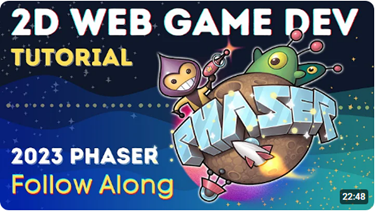

# APPLE-GAME-PHASER
Basado en este video:  
[](https://www.youtube.com/watch?v=0qtg-9M3peI)
>[!IMPORTANT] 
> * El código original está en este repositorio: 
>[Phaser-Apple-Catcher-Starter
](https://github.com/digitaldeja0/Phaser-Apple-Catcher-Starter)  
>del usuario [digitaldeja0](https://github.com/digitaldeja0) 
>desde Agosto 11 de 2023.
> * La librería base esta en este sitio: 
>[PHASER](https://phaser.io/).
> * Esta es una guía para empezar:
[Cómo crear tu primer juego con Phaser](https://phaser.io/tutorials/making-your-first-phaser-3-game-spanish#:~:text=Para%20iniciar%20un%20juego%20en,menudo%20desde%20una%20variable%20global.).

## 00 Precondiciones
1. Tener el Editor [Visual Studio Code](https://code.visualstudio.com/insiders/).
2. Extensiones insaladas dentro de 
`Visual Studio Code`:  
  * [Better Comments](https://marketplace.visualstudio.com/items?itemName=aaron-bond.better-comments) 
de [Aaron Bond](https://aaronbond.co.uk/).
  * [Error Lens](https://marketplace.visualstudio.com/items?itemName=usernamehw.errorlens) 
de [Alexander](https://marketplace.visualstudio.com/publishers/usernamehw).
  * [Javascript-Essentials](https://marketplace.visualstudio.com/items?itemName=Gydunhn.javascript-essentials)
  de [Gydunhn](https://marketplace.visualstudio.com/publishers/Gydunhn),  
  Este instala un paquete con:
    * ESLint
    * npm Intellisense 
    * IntelliCode
    * JavaScript (ES6) code snippets
    * Debugger for Firefox
    * Path Intellisense
    * Formatting Toggle
  * [Live Server](https://marketplace.visualstudio.com/items?itemName=ritwickdey.LiveServer)
  de [Ritwick Dey](https://marketplace.visualstudio.com/publishers/ritwickdey).
  * [Image preview](https://marketplace.visualstudio.com/items?itemName=kisstkondoros.vscode-gutter-preview)
  de [Kiss Tamás](https://marketplace.visualstudio.com/publishers/kisstkondoros) 
3. Instalar `nvm` descargando el instalador desde este sitio:
[nvm-setup.exe](https://github.com/coreybutler/nvm-windows/releases/download/1.1.12/nvm-setup.exe).
4. Instalar el `node`, que a su vez
trae el `npm` basado en este sitio: 
[Instalar múltiples versiones de Node.js en Windows](https://rafaelneto.dev/blog/instalar-multiples-versiones-nodejs-windows/).  
Con el `nvm` permite múltiples versiones
del `node`.
5. El programa `pnpm` es similar al `npm`, siendo un mejor empaquetador.  
Este lo puede conseguir con las instrucciones de este sitio
[pnpm Installation](https://pnpm.io/installation). 

## 01. Local Setup
1. Abrir una nueva `TERMINAL` y ejecutar el comando:
```bash
pnpm create vite@latest
```
* Project name: applegame
* Vanilla
* JavaScript
2. Pasamos el contenido de la carpeta "applegame" a la raiz del proyecto y borramos la carpeta "applegame", este es el resultado
esperado:  

3. Ejecutamos el comando en la `TERMINAL`:
```bash
pnpm install
```
4. Ejecutamos el comando en la `TERMINAL`:
```bash
pnpm i phaser
```
5. Ejecutamos el proyecto en la `TERMINAL` con:
```bash
pnpm dev
```
* La probable ruta puede ser: `http://localhost:5173/``
6. Navegamos a la ruta sugerida con cualquier browser.

## 02. Clean up Vite files
1. Empezamos con el archivo **style.css**, borrar todo excepto lo
relacionado con el `:root`.
2. Del `:root`, solo dejamos la línea de `font-family:`.
3. del archivo **main.js**, borrar todo menos la primera línea de
`import './style.css'`.
4. Borro los archivos:
  * **javascript.svg**
  * **counter.js**
5. Del archivo **index.html**, borramos la línea de 
`<div id="app"></div>`

>[!TIP]  
>### ESLint mejorador de javascript
>1. Tener instalado de forma global el `eslint`, con el comando:
>```bash
>npm install -g eslint
>```
>* **Esto solo se hace una vez y toca con el comando `npm`.**
>2. Instalar para el proyecto el paquete `standard`:
>```bash
>pnpm install standard -D
>```
>3. Crear el archivo **.eslintrc.json**, con este contenido:
>```json
> {
>   "extends": ["standard"],
>   "rules": {
>     "semi" : [2, "always"],
>     "comma-dangle": [2, "always-multiline"] 
>   }
> }
>```
>4. Presiono en `Visual Studio Code` las teclas: 
> [`Ctrl`] + [`Shift`] + [`P`]  
> y selecciono o busco `Restart ESLint Server`

>[!TIP]  
>### Si por alguna razón aparece el archivo **package-lock.json**, por favor borrarlo.  
>### Pues se supone estamos trabajando con `pnpm`.

## 03. Github Assets
1. Bajar del repositorio los [assets](https://github.com/digitaldeja0/Phaser-Apple-Catcher-Starter/tree/main/public/assets)
y poner esa carpeta en la carpeta "public".
2. Aprovechamos para borra el archivo **vite.svg** de la 
carpeta "public".
3. Así debe lucir hasta el momento nuestro proyecto:  


## 04. HTML Setup
1. Este capítulo es solo en el archivo **index.html**:
2. Cambiamos en la opción `"icon"` el `"/vite.svg"`, por 
`"/assets/favicon.ico"`
3. El `<title>`, lo cambiamos a `Apple Catcher`.
4. Al `<body>`, le agregamos tres elementos: `<header>`, `<main>` y
`<footer>`, todos antes del `<script ...">`.
5. Dentro del `<header>` , ponemos un `<p>`, con esto:
```html
      <p>Phaser Demo | Apple Catcher</p>
```
6. Dentro del `<footer>`, ponemos un `<p>`, con esto:
```html
      <p>Practicado por @JDGonzal <br>
        Colaboración @alquimiasoftwarecol</p>
```
7. En el `<main>` agrego un `<canvas>`, con esto:
```html
      <canvas id="gameCanvas"></canvas>
```
